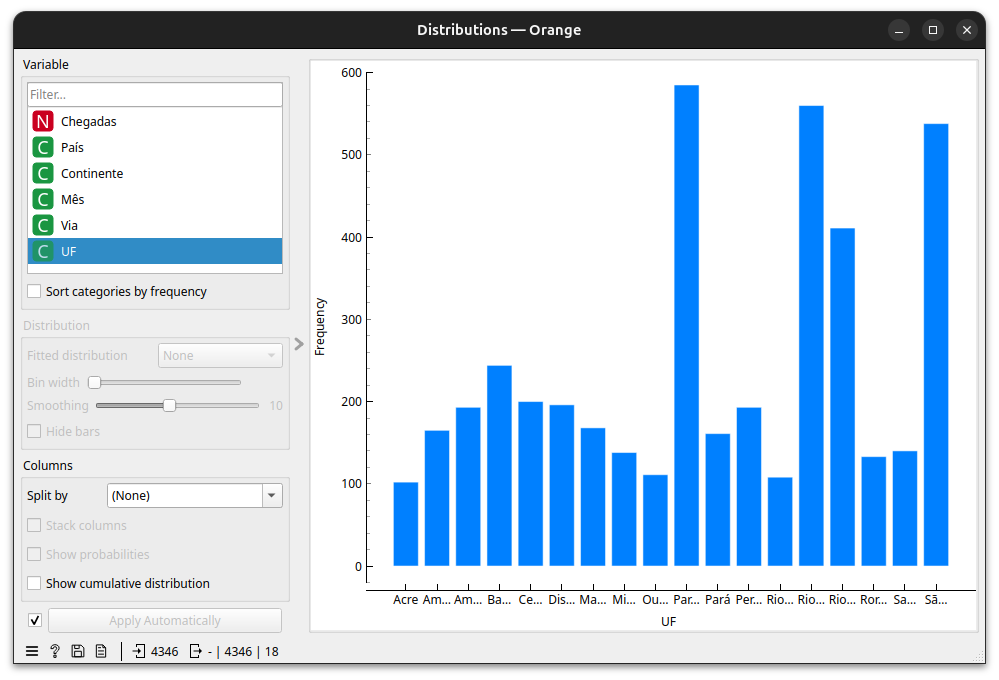
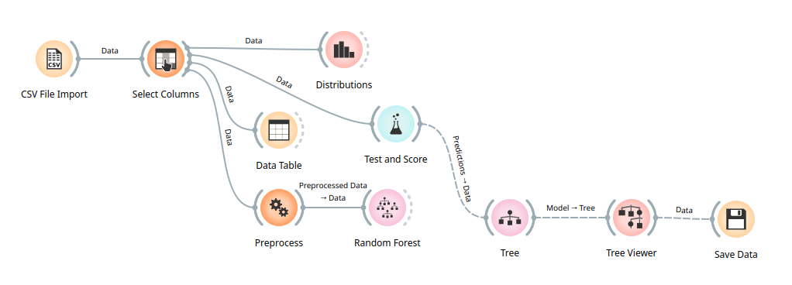

# Análise de Chegada de Turistas no Brasil

Este projeto utiliza a plataforma Orange Data Mining para analisar dados sobre a chegada de turistas estrangeiros ao Brasil. O fluxo de trabalho processa e visualiza dados demográficos e temporais para identificar padrões e tendências no turismo brasileiro.

## Tecnologias Utilizadas
- **Orange Data Mining 3.36+** (para análise visual de dados)
- Python (como linguagem subjacente do Orange)
- Bibliotecas de machine learning: Random Forest, Árvores de Decisão
- Formatos de dados: CSV, OWS (Orange Workflow Schema)

## Como Instalar e Rodar o Projeto

1. **Instale o Orange Data Mining**:
   ```bash
   pip install orange3
   ```
   Ou baixe a versão desktop: [Orange Official Site](https://orange.biolab.si/download/)

2. **Clone o repositório**:
   ```bash
   git clone https://github.com/seu-usuario/turismo-brasil.git
   ```

3. **Execute o fluxo de trabalho**:
   - Abra o Orange
   - Carregue o arquivo `projetoFase02.ows`
   - Conecte o widget "CSV File Import" ao arquivo `chegada_turistas_out23.csv`

## Como Usar o Projeto

O fluxo de trabalho principal (`projetoFase02.ows`) realiza:

1. **Pré-processamento**:
   - Seleção de atributos relevantes
   - Tratamento de dados faltantes
   - Normalização de variáveis

2. **Análise Exploratória**:
   - Visualização de distribuições por continente/país
   - Identificação de sazonalidade
   - Comparação entre vias de acesso (aérea/terrestre)

3. **Modelagem Preditiva**:
   - Previsão de fluxo turístico usando Random Forest
   - Classificação de padrões com Árvores de Decisão
   - Avaliação de modelos com Test and Score

## Estrutura do Projeto

```
📂 projeto-turismo/
├── 📄 chegada_turistas_out23.csv          # Dados brutos de chegadas
├── 📄 dados_turistas_out23.ows            # Fluxo principal de análise
├── 📂 github/
│   └── 📂 screenshots/                    # Capturas de tela do projeto
│       ├── 📸 distributions.png           # Distribuição de chegadas por país
│       └── 📸 esquema-orange.png          # Diagrama do workflow no Orange
└── 📄 README.md                           # Este arquivo de documentação
```

## Capturas de Tela

### Distribuição de Chegadas por Estado brasileiro


### Fluxo de Trabalho no Orange
